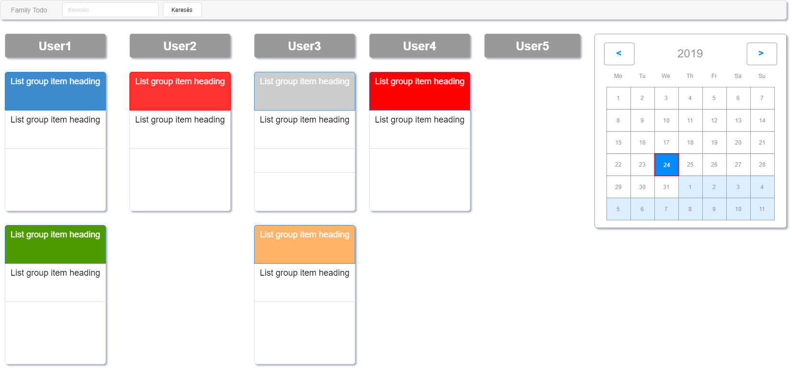
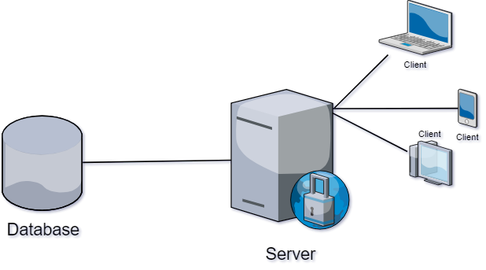

# Family Todo 

User Interface plan:



Family todo web-based fullstack application written in JavaScript. The Frontend was built in React.js and Bootstrap for the responsive and clean design for increase the user experience. The Server is a Node.js server, written in JavaScritpt, and uses express.js. To store datas, this application use MongoDB, which one is a NoSql database. Our plan is create multiple docker images for every services like frontend, backend, and the database. At the UI the user can see multiple cards or tasks, which contains the title, description and the place or time of things to do. There are multiple card colors (red, grey, blue, yellow).

Grey:
  * Can be done at any time
Green:
  * Low level task
Blue:
  * Higher than low level and less difficult than medium level
Yellow:
  * Medium leveltask
Red:
  * Very important task

Infrastructure plan:


Developers:

[Fodor Levente] 

[Bohnert Márton] 

[Sörös Csaba]

### Tech

The app uses a number of open source projects to work properly:

* [React.JS] - HTML enhanced for web apps!
* [Twitter Bootstrap] - great UI boilerplate for modern web apps
* [node.js] - evented I/O for the backend
* [Express] - fast node.js network app framework [@tjholowaychuk]


### Installation

App requires [Node.js](https://nodejs.org/) latest to run.

Install the dependencies and devDependencies and start the server.

```sh
$ cd familyTODO
$ npm install -d
```

### Todos

 - Write MORE Tests
 - Add multiply family use

License
----

MIT


[//]: # (These are reference links used in the body of this note and get stripped out when the markdown processor does its job. There is no need to format nicely because it shouldn't be seen. Thanks SO - http://stackoverflow.com/questions/4823468/store-comments-in-markdown-syntax)


   
   [Fodor Levente]: <https://github.com/Fodorlevente>
   [Bohnert Márton]: <https://github.com/n0b4d11>
   [Sörös Csaba]:<https://github.com/pikk7>
   [df1]: <http://daringfireball.net/projects/markdown/>
   [markdown-it]: <https://github.com/markdown-it/markdown-it>
   [Ace Editor]: <http://ace.ajax.org>
   [node.js]: <http://nodejs.org>
   [Twitter Bootstrap]: <http://twitter.github.com/bootstrap/>
   [jQuery]: <http://jquery.com>
   [@tjholowaychuk]: <http://twitter.com/tjholowaychuk>
   [express]: <http://expressjs.com>
   [React.JS]: <https://reactstrap.github.io/>
   [Gulp]: <http://gulpjs.com>

   [PlDb]: <https://github.com/joemccann/dillinger/tree/master/plugins/dropbox/README.md>
   [PlGh]: <https://github.com/joemccann/dillinger/tree/master/plugins/github/README.md>
   [PlGd]: <https://github.com/joemccann/dillinger/tree/master/plugins/googledrive/README.md>
   [PlOd]: <https://github.com/joemccann/dillinger/tree/master/plugins/onedrive/README.md>
   [PlMe]: <https://github.com/joemccann/dillinger/tree/master/plugins/medium/README.md>
   [PlGa]: <https://github.com/RahulHP/dillinger/blob/master/plugins/googleanalytics/README.md>
